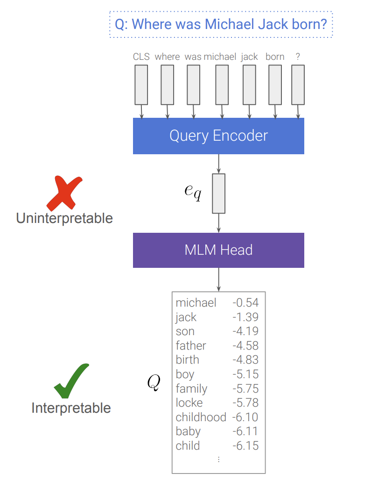

# SPLADERunner

*Title is dedicated to the Original Blade Runners - Harrison Ford and the Author  Philip K. Dick of "Do Androids Dream of Electric Sheep?"*

*Thanks to [Nils Reimers](https://www.linkedin.com/in/reimersnils/) for*
- All the MS-MARCO hard negatives.
- All his work in IR space, Pushing BEIR and MTEB benchmarks.
- The trolls :-) and
- For all the timely inputs especially around evaluation.

*Thanks to Naver folks, the original authors of the paper for such a robust research.*

## What is it?

A Ultra-lite &amp; Super-fast Python wrapper for the [independent implementation of SPLADEPlusPlus models](https://abc.com) for your search & retrieval pipelines. Based on the papers "From Distillation to Hard Negative Sampling: Making Sparse Neural IR Models More Effective":https://arxiv.org/pdf/2205.04733.pdf and "SPLADEv2": https://arxiv.org/abs/2109.10086 with some minor tweaks.

1. ⚡ **Ultra-lite & Superfast**: 
    - **No Torch or Transformers** needed. Runs on CPU.
    - **Retrieval Efficient**: Token budget concious models, hence low latency retrievals. Anserini numbers.
    - **Inference / Serving Efficient**: Optimised for best inference performance.

2. Note on Retrieval Efficieny and Industry suitability.
   Goal was not to be the SoTA model, but to be competitive yet efficient. Show the Token budget difference.
   FLOPS
   
   
## 🚀 Installation:
```python 
pip install spladerunner
```

## Usage:
```python
#One-time init
from spladerunner import Expander
expander = Expander() # Default is do expander model.

#Sample Document expansion
sparse_rep = expander.expand("The Manhattan Project and its atomic bomb helped bring an end to World War II. Its legacy of peaceful uses of atomic energy continues to have an impact on history and science.")
```

## Why Sparse Representations? 

(Feel free to skip to 3 If you are expert in sparse and dense representations)

- **Lexical search** with BOW based sparse vectors are strong baselines, but they famously suffer from **vocabulary mismatch** problem, as they can only do exact term matching. 

Pros

    ✅ Efficient and Cheap.
    ✅ No need to fine-tune models.
    ✅️ Interpretable.
    ✅️ Exact Term Matches.

Cons

    ❌ Vocabulary mismatch (Need to remember exact terms)

<br/>

- **Semantic Search** Learned Neural /  Dense retrievers with approximate nearest neighbors search has shown impressive results but they can 

Pros

    ✅ Search how humans innately think.
    ✅ When finetuned beats sparse by long way.
    ✅ Easily works with Multiple modals.

Cons

    ❌ Suffers token amnesia (misses term matching), 
    ❌ Resource intensive (both index & retreival), 
    ❌ Famously hard to interpret.
    ❌ Needs fine-tuning for OOD data.

<br/>

- Getting pros of both searches made sense and that gave rise to interest in **learning sparse representations** for queries and documents with some interpretability. The sparse representations also double as implicit or explicit (latent, contextualized) expansion mechanisms for both query and documents. If you are new to [query expansion learn more here from Daniel Tunkelang.](https://queryunderstanding.com/query-expansion-2d68d47cf9c8)


2b. **What the Models learn?**
- The model learns to project it's learned dense representations over a MLM head to give a vocabulary distribution.
- <center></center>

## 3. 💸 **Why SPLADERunner?**:
    - **$ Concious:** Serverless deployments like Lambda are charged by memory & time per invocation*
    - **Smaller package size** = shorter cold start times, quicker re-deployments for Serverless.
    - **Permissive License**. (You can use it commercially with Source attribution).

## 4. 🎯 **Models**:
    - Below are the list of models supported as of now.
        * [DOST/SPLADEplusplus_EN](https://huggingface.co/DOST/SPLADEplusplus_EN) (default model)

4. 💸 **Where and How can you use?**
- [TBD]

5. **How (and what) to contribute?**
- [TBD]

6. **Criticisms and Competitions to SPLADE and Learned Sparse representations:**

- [Wacky Weights in Learned Sparse Representations and the Revenge of Score-at-a-Time Query Evaluation](https://arxiv.org/pdf/2110.11540.pdf)
- [Query2doc: Query Expansion with Large Language Models](https://arxiv.org/pdf/2303.07678.pdf) 
*note: don't mistake this for docT5query, this is a recent work*
